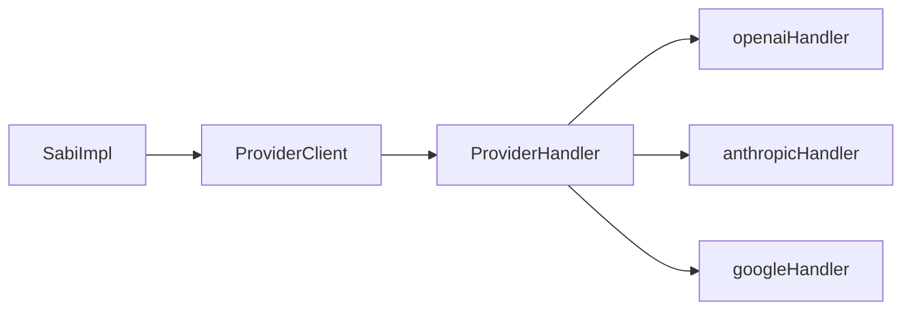

# Architecture

`@weysabi/sabi` is a single-package, Bun-native AI orchestration library. All source lives in `src/`, tests live next to source.

## Module Map

| File                         | Purpose                                                                    |
| ---------------------------- | -------------------------------------------------------------------------- |
| `src/index.ts`               | `SabiImpl` class + `createSabi()` factory. Entry point.                    |
| `src/types.ts`               | Zod schemas + TS interfaces                                                |
| `src/providers.ts`           | `ProviderClient` — dispatches to handlers, retry, circuit breaker, timeout |
| `src/providers/handler.ts`   | `ProviderHandler` interface                                                |
| `src/providers/openai.ts`    | OpenAI-compatible handler (Groq, Nvidia, DeepSeek, OpenRouter, Together)   |
| `src/providers/anthropic.ts` | Anthropic Messages API handler                                             |
| `src/providers/google.ts`    | Google Gemini handler                                                      |
| `src/prompts.ts`             | `PromptRegistry` — stores templates, renders `{variable}`                  |
| `src/sse.ts`                 | Generic `toResponse(stream)` — returns `Response` for Web Fetch frameworks |
| `src/stream.ts`              | `readStream` — client-side async generator for consuming SSE               |
| `src/errors.ts`              | 7 error classes extending `SabiError`                                      |
| `src/utils.ts`               | `parseModel`, `tryParseJSON`                                               |
| `src/logger.ts`              | Structured logger via `@joinremba/catalog`                                 |
| `src/hono.ts`                | Re-exports `toResponse` from `sse`                                         |
| `src/next.ts`                | Re-exports `toResponse` from `sse`                                         |
| `src/elysia.ts`              | Re-exports `toResponse` from `sse`                                         |
| `src/express.ts`             | `pipe(stream, res)` for Express                                            |
| `src/fastify.ts`             | `pipe(stream, reply)` for Fastify                                          |

## Sub-path Exports

Each adapter is a flat sub-path export in `package.json`:

```
@weysabi/sabi
@weysabi/sabi/errors
@weysabi/sabi/sse
@weysabi/sabi/hono
@weysabi/sabi/next
@weysabi/sabi/express
@weysabi/sabi/fastify
@weysabi/sabi/elysia
```

Zero cost if unused — tree-shakeable by the bundler.

## Provider System



`ProviderClient` handles cross-cutting concerns (retry, backoff, circuit breaker, logging) and delegates provider-specific logic (URL, headers, body format, response parsing) to `ProviderHandler` implementations.

Provider + model notation: `provider/model-id` (e.g. `groq/llama-4-scout`, `anthropic/claude-3-5-sonnet-20241022`).

## Conventions

- Named exports only. No `export default` except `createSabi` factory.
- Zod for all runtime validation.
- Custom error classes extending `SabiError`.
- Tests mock `globalThis.fetch` — no real API calls.
- Tests next to source: `src/*.test.ts`.
- Structured logging via `createModuleLogger("module.name")`.

## Dependencies

- **Runtime**: `zod`, `@joinremba/catalog`
- **Dev**: `@types/bun`, `eslint`, `prettier`, `typescript`
